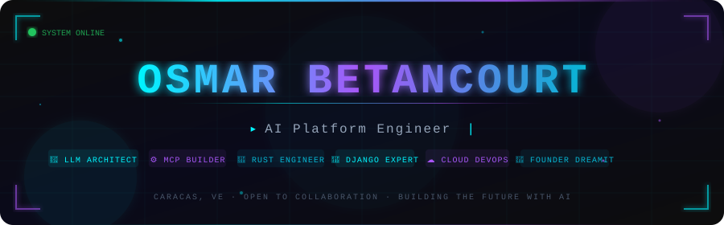

<div align="center">
  
</div>

<br/>

<div align="center">

[](https://git.io/typing-svg)

</div>

<br/>

---

## ⚡ About Me

```rust
struct Engineer {
    name:       &'static str,
    location:   &'static str,
    company:    &'static str,
    stack:      [&'static str; 6],
    superpower: &'static str,
}

const OSMAR: Engineer = Engineer {
    name:       "Osmar Betancourt",
    location:   "Caracas, Venezuela 🇻🇪",
    company:    "Founder @ DreamIT Software",
    stack:      ["Rust/Axum", "Django/ADRF", "Next.js", "OpenAI SDK", "MCP", "K8s"],
    superpower: "Turning cutting-edge AI into production-grade platforms",
};
```

- 🤖 **5+ years** working on IT and building software solutions
- 🦀 Building **A lot of open source projects** — some with Rust/Axum analytics engine with dual-DB architecture
- 🐍 Contributed to **integrating LLMs with automatic payments with national banks** — Django + AWS + K8s AI backend with OpenAI Agents SDK & MCP
- 🏗️ Founder of **[DreamIT Software](https://dreamit.software)** — B2B/B2C AI consulting & development
- 🎓 **Hugging Face Certified** (LLMs · MCP · Agents) · Datacamp AI/Data Engineer · 50+ certs
- 🌐 C2 English · Native Spanish · Mentor to junior devs

<br/>

---

## 🚀 Featured Projects

<table>
<tr>
<td width="50%" valign="top">

### 🌌 [DreamIT](https://github.com/osmarbetancourt/DreamIT)
**Agency · [dreamit.software](https://dreamit.software)**

Cinematic 3D agency site — scroll-driven vertical ascent from launchpad to orbit. Astronaut physics, wormhole shaders, volumetric clouds, real-time particle systems. Device-adaptive rendering achieves **95+ Lighthouse desktop / 90+ mobile**. Django + Next.js + Docker on Hetzner.

`Next.js 16` `Three.js` `GSAP` `React 19` `TypeScript` `Django` `Docker` `Hetzner`

</td>
<td width="50%" valign="top">

### 🐉 [DragonLog](https://github.com/osmarbetancourt/DragonLog)
**App · [thydragonlog.com](https://thydragonlog.com)**

Dark-fantasy immersive experience — GSAP-driven tome portal, translocation veil, and a rune-laden landing keep. Cursor rune trails, ember particle fields, phase-aware ambient audio, and scroll-triggered reveals deployed via GitHub Actions → Hetzner.

`Next.js 15` `Three.js` `GSAP` `TypeScript` `Web Audio API` `Docker` `Hetzner`

</td>
</tr>
<tr>
<td width="50%" valign="top">

### 🔌 [custom-mcp](https://github.com/osmarbetancourt/custom-mcp)
**Production MCP Framework**

Extensible AI agent server that auto-generates MCP tools from OpenAPI specs. Bridges GitHub Copilot, Claude, and any LLM to cloud APIs — including full Render.com infrastructure orchestration via natural language.

`Python` `FastAPI` `Hugging Face MCP` `AWS` `GCP`

</td>
<td width="50%" valign="top">

### 🌐 [Portfolio](https://github.com/osmarbetancourt/betancourt-osmar-portfolio)
**[betancourtosmar.com](https://www.betancourtosmar.com)**

AI-powered portfolio with a live chatbot running a **custom fine-tuned Mistral-7B** (LoRA on Django Q&A) + Gemini fallback. Code generation, image generation, Google OAuth — full-stack Django + React on Hetzner with Caddy.

`Django` `React` `Mistral-7B` `LoRA` `Gemini` `Pinecone` `Docker`

</td>
</tr>
<tr>
<td width="50%" valign="top">

### 🛒 [ecommerce-ai-agent](https://github.com/osmarbetancourt/ecommerce-ai-agent)
**Intelligent Commerce Platform**

Full-stack AI grocery platform: load times cut from **5–6s → 60ms** across 500+ products. Conversational agent handles cart management, product recommendations, and full checkout via natural language + RAG.

`TypeScript` `Next.js` `RAG` `AI Agents` `Analytics`

</td>
<td width="50%" valign="top">

### 🧠 [codegen-rag](https://github.com/osmarbetancourt/codegen-rag)
**Enterprise Knowledge Platform**

High-performance RAG pipeline with Pinecone vector embeddings. Sub-second retrieval on **100K+ documents**. Custom embedding models for domain-specific enterprise Q&A and developer knowledge search.

`Python` `Pinecone` `Hugging Face` `Vector DB` `ETL`

</td>
</tr>
</table>

<br/>

---

## 🛠️ Tech Stack

### 🤖 AI / ML / Agents
<p>
  
  
  
  
  
  
  
  
  
  
  
</p>

### ⚙️ Backend
<p>
  
  
  
  
  
  
  
  
  
</p>

### 🗄️ Databases & Cache
<p>
  
  
  
  
  
  
</p>

### 🌐 Frontend
<p>
  
  
  
  
  
  
  
</p>

### ☁️ DevOps & Cloud
<p>
  
  
  
  
  
  
  
  
  
  
</p>

<br/>

---

## 📊 GitHub Stats

<div align="center">
  
  
</div>

<div align="center">
  
</div>

<br/>

<div align="center">
  
</div>

<br/>

---

## 🏆 Trophies

<div align="center">
  
</div>

<br/>

---

## 🐍 Contribution Snake

<div align="center">
  <picture>
    <source media="(prefers-color-scheme: dark)" srcset="https://raw.githubusercontent.com/osmarbetancourt/osmarbetancourt/output/github-contribution-grid-snake-dark.svg"/>
    <source media="(prefers-color-scheme: light)" srcset="https://raw.githubusercontent.com/osmarbetancourt/osmarbetancourt/output/github-contribution-grid-snake.svg"/>
    
  </picture>
</div>

<br/>

---

## 🎖️ Certifications

<div align="center">

| Certification | Issuer | Focus |
|:---|:---:|:---:|
| 🤗 **Hugging Face LLMs** | Hugging Face | Large Language Models |
| 🤗 **Hugging Face Agents** | Hugging Face | AI Agents & Tooling |
| 🤗 **Hugging Face MCP** | Hugging Face | Model Context Protocol |
| 📊 **Associate AI Engineer for Developers** | Datacamp | Python · LLM Development |
| 🛠️ **Data Engineer** | Datacamp | ETL · Pipelines · Data Infra |
| 🔷 **Atlassian Certified** | Atlassian | Jira Data Center & Cloud |
| ➕ **50+ certs** | Various | AI · MLOps · DevOps · Cloud |

</div>

<br/>

---

## 🤝 Let's Connect

<div align="center">

[](https://www.betancourtosmar.com/)
[](https://dreamit.software)
[](https://www.linkedin.com/in/BetancourtOsmar)
[](mailto:osmar.betancourt@dreamit.software)

</div>

<br/>

<div align="center">
  
</div>

<div align="center">
  <sub><code>// Built with 🤖 AI · 🦀 Rust · ☕ caffeine · from Caracas to the world</code></sub>
</div>
