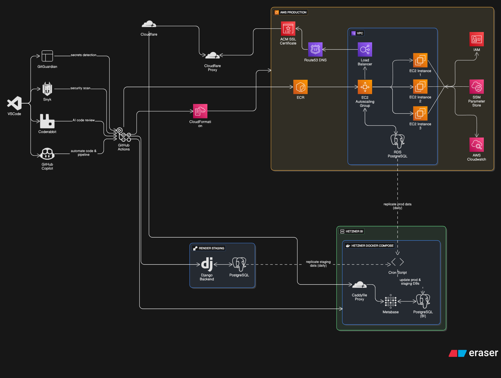

# I'm Osmar Betancourt

**Tech Leader & End-to-End AI Platform Engineer (Full Stack · Cloud · DevSecOps · Security · MCPs - Agents)**

Welcome! I specialize in end-to-end AI platform engineering, designing scalable agent frameworks, and bridging cutting-edge AI (LLMs, Generative AI, Custom MCPs) with enterprise-grade fullstack engineering and DevSecOps practices.

---

## 🏆 Value Proposition

- **Certified AI Specialist** (Hugging Face, Datacamp) with production AI deployments
- **MCP Architect & Agent Developer:** Build context-driven agent frameworks, API integrations, and custom GitHub Copilot tools
- **Cloud Solutions Engineer:** Design and implement scalable infrastructure across AWS and GCP
- **Rapid Prototyper:** Deliver production-ready AI, ETL, and fullstack applications with CI/CD automation
- **DevSecOps Specialist:** Expertise in Docker, security practices, Infrastructure as Code, and scalable deployments
- **Team Leader & Mentor:** Drive cross-functional teams, onboard juniors, and deliver complex solutions under pressure

---

## 🧠 Skills & Toolbox

**AI/ML & Agent Development:**  
     
LLMs (OpenAI GPT, Gemini, Claude, Custom Models), RAG Systems, Q&A Agents, LoRA/PEFT Fine-tuning, Vector Databases (Pinecone, Chroma), MCP Framework Development

**Backend & Data Engineering:**  
       
ETL Pipelines, Data Warehousing, NoSQL (MongoDB, Snowflake), Microservices Architecture, API Gateway Design, Real-time Data Processing

**Frontend:**  
     
Designing modern websites with a friendly UI and UX with cutting edge technology.

**DevOps & Cloud:**  
       
CI/CD Pipelines, Infrastructure as Code, Monitoring & Observability, Jira, GitHub Actions, Custom MCPs

---

## 🤖 AI Agents & Tools

- **GitHub Copilot:** Advanced integration, custom MCP server development, prompt engineering, and workflow automation
- **Custom MCP Frameworks:** Build extensible agent systems with API orchestration and tool auto-generation
- **CodeRabbit:** AI-powered code review, automated testing, and CI/CD integration
- **Claude, Gemini, OpenAI Agents:** Multi-model orchestration, fine-tuning, and production deployment
- **Perplexity AI:** Advanced search integration and knowledge base development
- **Vector Database Systems:** Pinecone, Chroma, and custom RAG implementations for enterprise knowledge management

---

## 🚀 Featured Projects

| Project                                             | Description                                                             | Tech Stack         |
|-----------------------------------------------------|-------------------------------------------------------------------------|--------------------|
| [custom-mcp](https://github.com/osmarbetancourt/custom-mcp)             | **Production MCP Framework** - Extensible AI agent server with auto-generated tools from OpenAPI specs, cloud orchestration (AWS/GCP), and enterprise GitHub Copilot integration. | Python, FastAPI, Hugging Face MCP, Cloud |
| [codegen-rag](https://github.com/osmarbetancourt/codegen-rag)           | **Enterprise Knowledge Platform** - High-performance RAG pipeline with vector embeddings, sub-second retrieval, and contextual AI assistance for development teams. | Python, Pinecone, Vector DB, Hugging Face |
| [osmar-generative-ai](https://github.com/osmarbetancourt/osmar-generative-ai) | **AI Model Laboratory** - Custom-tuned LLMs, LoRA/PEFT fine-tuning experiments, and specialized AI agents for domain-specific tasks. | Python, PyTorch, Hugging Face, MLOps |
| [ecommerce-ai-agent](https://github.com/osmarbetancourt/ecommerce-ai-agent)   | **Intelligent Commerce Platform** - Full-stack AI-powered grocery platform with conversational agents, predictive analytics, and personalized recommendations. | TypeScript, Next.js, AI Agents, Analytics |
| [central-ai](https://github.com/osmarbetancourt/central-ai)             | **AI Governance Hub** - Comprehensive knowledge base for LLM architecture, best practices, governance frameworks, and team onboarding processes. | Documentation, Architecture, DevOps |
| [betancourt-osmar-portfolio](https://github.com/osmarbetancourt/betancourt-osmar-portfolio) | **Interactive AI Portfolio** - Professional website showcasing live AI demos, cloud projects, and interactive technical demonstrations. | Django, Docker, React, AI Integration |
| [project-mika-ai](https://github.com/osmarbetancourt/project-mika-ai) | **Real-time AI Platform** - Unity-based client with Python WebSocket backend, Google Vertex AI integration, and real-time AI processing capabilities. | Python, WebSockets, C#, Unity, Google AI |

---

## 🏗️ Architecture & Design

**Cloud Architecture Design:**

*Current project architecture showcasing cloud infrastructure design with scalable deployments across AWS, Render and Hetzner, emphasizing high availability, fault tolerance, and optimal resource distribution.*

---

## 💼 Experience & Certifications

**Current:**  
**Tech Leader & End-to-End AI Platform Engineer** @ Moneybook (2025–Present)  
*Designing and implementing full AWS architecture and DevOps strategy for virtual AI assistant platform focused on bank debt collection. Developing entire backend in Django, containerizing solutions with Docker, and engineering custom AI agents using OpenAI Agents SDK and Model Context Protocol (MCP).*

**Past:**  
- **IT Technical Leader & Senior Jira Analyst** @ Solutions for Everyone S4E (2024–2025)
- **Jira Analyst & AWS Cloud Practitioner** @ Solutions for Everyone S4E (2021–2024)

**Certifications & Expertise:**  
- **Hugging Face Certified** (LLMs, MCP, Agents)
- **Datacamp Associate AI Engineer for Developers, Data Engineer, Professional Data Engineer** (Python, Developing LLMs)
- **GitHub Copilot Advanced** (MCP integration, Custom tools)
- **Atlassian Certified** (Managing Jira Projects for Data Center & Cloud)
- **50+ IT/AI/Cloud Certifications** (Current stack: AI, MLOps, DevOps, Cloud)

**Languages:**  
- English (C2, Advanced)
- Spanish (Native)

---

## 🖇️ Connect

- 🌐 [Portfolio & Blog](https://www.betancourtosmar.com/)
- 💼 [LinkedIn](https://www.linkedin.com/in/osmarbetancourt/)
- ✉️ [Email](mailto:oaba.dev@gmail.com)

---

## 📊 GitHub Stats

---

**Pinned Repos:**  
Check out my flagship projects—each with detailed documentation and onboarding guides!

*Open to collaboration, research, and new opportunities in the AI & fullstack space.*
